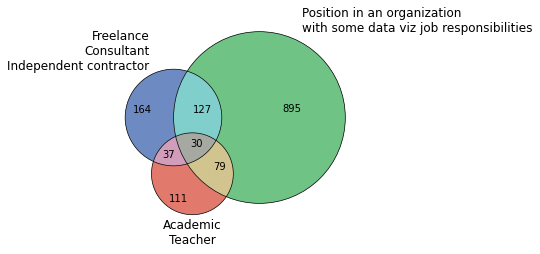
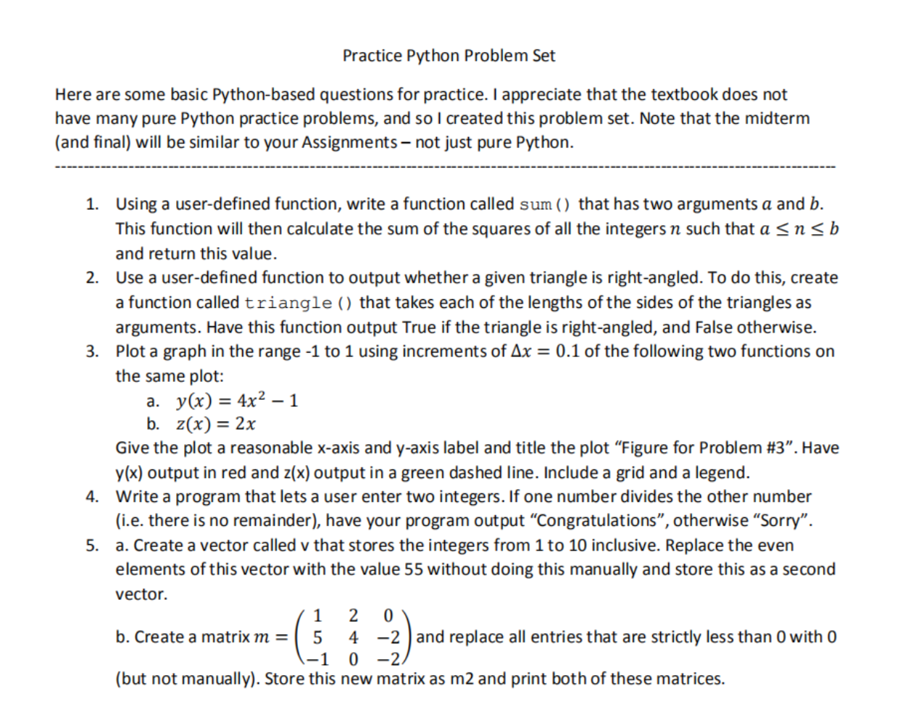

# python_helpfull_staff
Some basc triks

[Venn circles.ipynb](https://github.com/lexabak3/python_helpfull_staff/blob/main/Venn_circles.ipynb)

[Practice Python Problem Set.ipynb](https://github.com/lexabak3/python_helpfull_staff/blob/main/Practice_Python_Problem_Set.ipynb)

