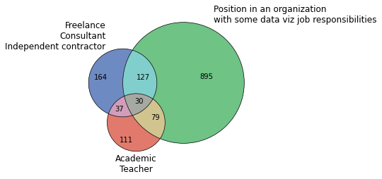
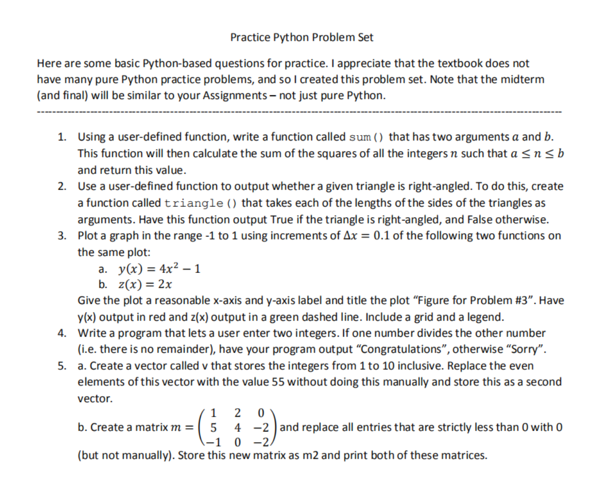

# python_helpfull_staff
Some basc triks

[Save the picture in RAM and insert it into the xlsx report](https://github.com/lexabak3/python_helpfull_staff/blob/main/png_into_xlsx_pd_report.ipynb)

[Venn circles.ipynb](https://github.com/lexabak3/python_helpfull_staff/blob/main/Venn_circles.ipynb)

[Practice Python Problem Set.ipynb](https://github.com/lexabak3/python_helpfull_staff/blob/main/Practice_Python_Problem_Set.ipynb)

